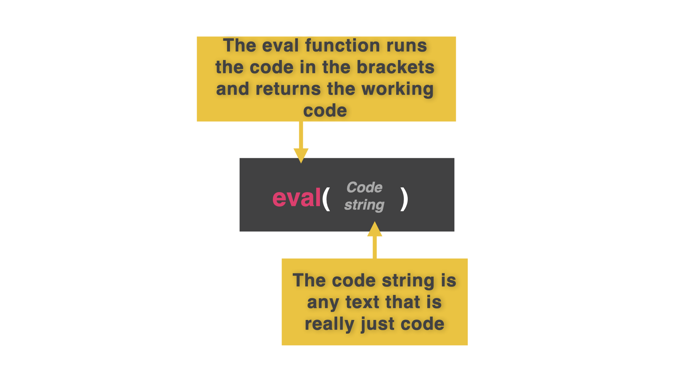

# Preventing Data Loss

Did you find the problem?

Yep. Every time we run the program, it creates a new, blank `myEvents[]` list which gets written to the file.

This **overwrites** any events in the file that we saved when we ran the program previously.
##
To solve this, we set up the program to load any pre-existing data from the file into the `myEvents` list at the very start of the code.

Pay close attention to the `eval()` function. It's the special sauce here...

👉 `eval()` takes the text from the file, converts it into running code, and assigns it to `myEvents[]` as a 2D list.  Good, eh?

```python
myEvents = []

####### THIS IS THE NEW BIT ################
f.open("calendar.txt","r") # Only need read permissions here
myEvents = eval(f.read())
f.close()
########################################

def prettyPrint():
  print()
  for row in myEvents:
    print(f"{row[0] :^15} {row[1] :^15}")
  print()

while True:
  menu = input("1: Add, 2: Remove\n")

  if menu == "1":
    event = input("What event?: ").capitalize()
    date = input("What date?: ")
    row = [event,date]
    myEvents.append(row)
    prettyPrint()

  else:
    criteria = input("What event do you want to remove?: ").title()
    for row in myEvents:
      if criteria in row:
        myEvents.remove(row)

  
  f = open("calendar.txt", "w") 
  f.write(str(myEvents)) 
  f.close()
  
```

### Try it out! Did you run the auto-save code first?